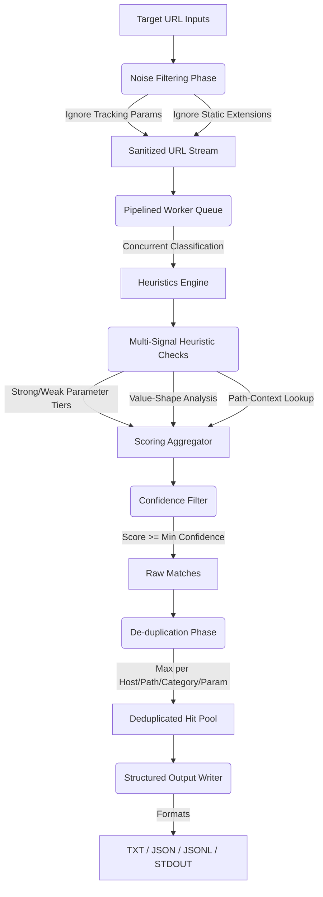

# 🐱 Vulncat

**Vulncat** is a professional-grade, high-performance vulnerability-surface URL classifier written in Go. It parses and classifies URLs into likely testing categories (SQLi, XSS, SSRF, LFI, RCE, IDOR) using multi-signal heuristics, parameter name tiering, value-shape analysis, and path context. 

Designed for security researchers and bug bounty hunters, it runs as a concurrent, memory-efficient streaming pipeline that can process millions of URLs with zero memory bloat, integrating seamlessly into Unix-style command lines.

---

## 🗺️ Engine Architecture & Pipeline

Vulncat operates using a structured, high-speed streaming pipeline that filters noise and classifies parameters with high precision:



---

## 🚀 Features

* **High Performance**: Replaced all heavy regular expressions with optimized Go standard library functions and custom char loops.
* **REST API Path Scanner**: Analyzes URL path segments for SQLi, IDOR, and LFI surfaces when parameters are placed directly in the endpoint path (e.g., `/users/1001` or `/download/../../etc/passwd`).
* **Pipelined Concurrency**: Powered by a concurrent worker pool that processes URLs in streams, maintaining a tiny memory footprint even with gigabytes of input.
* **Unix Pipe Support**: Integrates into recon pipelines (`cat urls.txt | vulncat -s`).
* **Multi-Signal Heuristics**: Analyzes not just parameter names, but value shapes (URL-like, path-like, command-like, numeric) and path context words.
* **Smart Deduplication**: Avoids bloated results by capping matched URLs per distinct endpoints (host, path, category, parameter).
* **Flexible Outputs**: Generates categorized `.txt` lists, structured JSON reports, or JSON Lines (JSONL) for CLI manipulation (`jq`).

---

## 🔧 Installation & Build

### Direct Installation
If you have Go 1.21+ installed and configured on your path, you can download and install Vulncat directly:
```bash
go install -v github.com/youwannahackme/vulncat@latest
```

### Manual Build
Alternatively, you can clone and build the binary manually:
```bash
# Clone the repository
git clone https://github.com/youwannahackme/vulncat.git
cd vulncat

# Build the binary
go build -o vulncat

# Run the unit tests to verify logic correctness
go test -v ./...
```

---

## 📖 Usage & CLI Reference

```
Usage:
  ./vulncat [options]

Options:
  -u, -url string
        Single URL to classify
  -l, -list string
        Path to urls.txt (one URL per line, or '-' for stdin)
  -o, -output string
        Output directory (default "urlclass_out")
  -min-confidence int
        Minimum confidence (0-100) to tag a category (default 40)
  -max-per-pattern int
        Max URLs kept per (host, path, category, param) group (default 5)
  -c, -concurrency int
        Number of concurrent worker threads (default 20)
  -s, -silent
        Silent mode (prints matched URLs only, suppresses banner & logs)
  -jsonl
        Output results in JSON Lines (.jsonl) format instead of JSON (.json)

Category Filters:
  -sqli      Scan only for SQL injection vulnerability surface
  -xss       Scan only for Cross-Site Scripting vulnerability surface
  -ssrf      Scan only for Server-Side Request Forgery vulnerability surface
  -lfi       Scan only for Local File Inclusion vulnerability surface
  -rce       Scan only for Remote Code Execution vulnerability surface
  -idor      Scan only for Insecure Direct Object Reference vulnerability surface
  -redirect  Scan only for Open Redirect vulnerability surface
  -ssti      Scan only for Server-Side Template Injection vulnerability surface
  -nosqli    Scan only for NoSQL Injection vulnerability surface
  -cors      Scan only for CORS Misconfiguration vulnerability surface
  -jwt       Scan only for JWT Injection vulnerability surface
  -privesc   Scan only for Privilege Escalation vulnerability surface
  -xxe       Scan only for XML External Entity vulnerability surface
  -proto     Scan only for Prototype Pollution vulnerability surface
  -cat       Comma-separated list of categories to scan (e.g. -cat sqli,xss)
```

### Examples

#### Real-time CLI Categorized Output
Scan for all categories and print matches to terminal with category tags:
```bash
./vulncat -l urls.txt
# Output: [sqli:80][idor:100] https://target.com/users/1002
```

#### Scan for Specific Vulnerability Surface Area (e.g., SQLi & SSRF only)
Limit execution filters to select categories:
```bash
cat urls.txt | ./vulncat -sqli -ssrf
# or
cat urls.txt | ./vulncat -cat sqli,ssrf
```

#### Stream Pipeline (Silent Output)
Pipe live URLs and send identified SQLi endpoints directly to active tools:
```bash
cat urls.txt | ./vulncat -silent -sqli | grep "target.com"
```

#### JSON Lines Extraction
Fetch classified targets, outputting them in JSONL structure, and query them with `jq`:
```bash
cat urls.txt | ./vulncat -silent -jsonl | jq '.categories.ssrf'
```

---

## 🛡️ Heuristics & Scoring Engine

Vulncat evaluates parameters by summing weights across three key layers:

| Layer | Trigger Condition | Score Bonus |
| :--- | :--- | :--- |
| **Strong Param** | Known parameter matching a category sink (e.g., `id` for SQLi, `url` for SSRF) | `+40` |
| **Weak Param** | Weak parameter indicator (e.g., `page` for SQLi, `site` for SSRF) | `+20` |
| **Value Shape** | Value matches target pattern (e.g., numeric, path-like, command-like) | `+30` |
| **Path Context** | Endpoint path directory contains category keywords (e.g., `/api/`, `/download/`) | `+10` |
| **IDOR Numeric** | Numeric ID verification for IDOR targeting | `+20` |

---

## ⚔️ Vulncat vs. gf (tomnomnom)

While `gf` is a popular tool for finding vulnerability endpoints, it has key architectural limitations compared to **Vulncat**:

| Comparison Metric | **Vulncat** | **gf / gf-patterns** |
| :--- | :--- | :--- |
| **Parsing Engine** | Parsed URL structures (parameter keys/values) | Flat regex string search (`grep` / `ripgrep`) |
| **REST Path Scanning** | **Yes** (infers IDOR/LFI in paths `/users/102`) | **No** (query parameters only) |
| **Scoring Heuristics** | **Yes** (assigns confidence scores `0-100`) | **No** (matches static strings blindly) |
| **False Positive Filters** | **Yes** (automatically filters tracking params/UTM) | **No** (matches raw words anywhere on the line) |
| **Performance** | Go concurrent stream pipeline (fast) | Spawns multiple `rg` processes (slow) |
| **Structured Output** | JSON, JSONL, and Categorized Text files | Raw stdout lines |

### Practical Example
* **Target URL**: `https://example.com/item/1002?utm_source=google&fbclid=xss`
  - **`gf xss`**: Matches because the keyword `xss` is found inside the `fbclid` tracking parameter value (False Positive).
  - **`vulncat`**: Automatically strips `fbclid` and maps `/item/1002` to **IDOR** (Confidence: `90`) through path segment inference (True Positive).

---

## 👤 Author & Repository

* **whoami_404**
* **GitHub**: [github.com/youwannahackme](https://github.com/youwannahackme)
