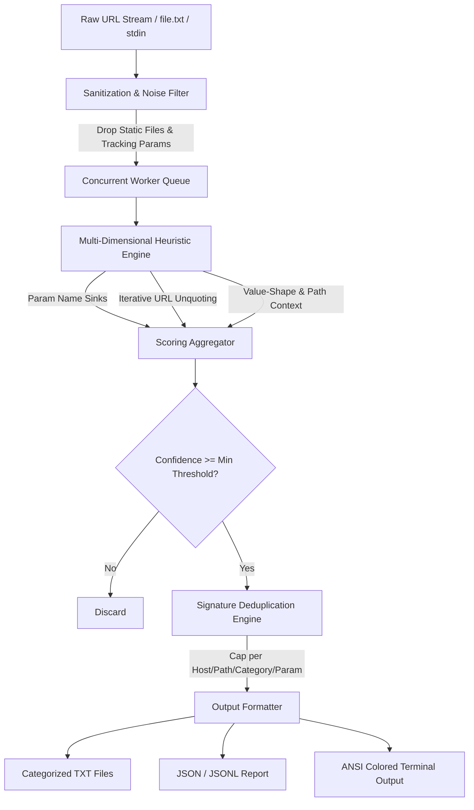

<div align="center">

# ⚡ Vulncat

**High-Performance, Quantitative Vulnerability-Surface URL Classifier for Bug Bounty & Recon Pipelines**

[](https://golang.org)
[](LICENSE)
[](#-supported-vulnerability-categories)
[](#-engine-architecture--pipeline)

</div>

---

## 🌟 Overview

**Vulncat** is a professional-grade, high-speed vulnerability-surface URL classifier written in Go. Unlike traditional regex-based reconnaissance wrappers, Vulncat parses URL query parameters and REST path segments into structured elements, evaluating them through **multi-dimensional heuristic scoring** (`0..100`).

Designed specifically for **security researchers, penetration testers, and bug bounty automation**, Vulncat processes millions of endpoints in seconds with zero memory bloat, automatically stripping reconnaissance noise (`utm_source`, `fbclid`, static `.js`/`.css` files) and capping redundant matches (`-max-per-pattern`).

```text
   ██╗   ██╗██╗   ██╗██╗     ███╗   ██╗ ██████╗  █████╗ ████████╗
   ██║   ██║██║   ██║██║     ████╗  ██║██╔════╝ ██╔══██╗╚══██╔══╝
   ██║   ██║██║   ██║██║     ██╔██╗ ██║██║      ███████║   ██║   
   ╚██╗ ██╔╝██║   ██║██║     ██║╚██╗██║██║      ██╔══██║   ██║   
    ╚████╔╝ ╚██████╔╝███████╗██║ ╚████║╚██████╗ ██║  ██║   ██║   
     ╚═══╝   ╚═════╝ ╚══════╝╚═╝  ╚═══╝ ╚═════╝ ╚═╝  ╚═╝   ╚═╝   

   ⚡ ADVANCED VULNERABILITY SURFACE CLASSIFIER & RECON ENGINE ⚡
   ━━━━━━━━━━━━━━━━━━━━━━━━━━━━━━━━━━━━━━━━━━━━━━━━━━━━━━━━━━━━
     • Author     : whoami_404
     • Repository : github.com/youwannahackme/vulncat
   ━━━━━━━━━━━━━━━━━━━━━━━━━━━━━━━━━━━━━━━━━━━━━━━━━━━━━━━━━━━━
```

---

## 🚀 Key Features

- **⚡ Blazing Fast Concurrency**: Powered by a bounded Go worker pool (`-concurrency 20` default) and `O(1)` map lookups, replacing slow regex backtracking with zero-copy character loops.
- **🎯 14 Comprehensive Categories**: Detects surface points for **SQLi, XSS, SSRF, LFI, RCE, IDOR, Redirect, SSTI, NoSQLi, CORS, JWT, PrivEsc, XXE, and Proto**.
- **🌐 REST Path & Parameter Analysis**: Analyzes both URL query strings (`?id=5`) and REST endpoint path directories (`/api/users/1001` or `/view/..%2f..%2fpasswd`).
- **🧠 Multi-Level Heuristic Scoring**: Evaluates parameter name sinks (strong vs. weak), value shapes (numeric, command args, JSON/bools, template payloads), and path contexts.
- **🔇 Intelligent Noise & Tracking Filter**: Automatically drops static file extensions (`.css`, `.png`, `.woff`) and strips marketing/tracking noise (`fbclid`, `utm_medium`, `gclid`).
- **🛑 Signature-Based Deduplication**: Caps output at `N` (default `5`) matches per unique `(Host, Path, Category, Param)` tuple, preventing massive reconnaissance lists from flooding downstream scanners.
- **📊 Rich Structured Outputs**: Generates categorized `.txt` lists (`sqli.txt`, `xss.txt`), comprehensive JSON reports (`report.json`), or streaming **JSON Lines (`-jsonl`)** for `jq` and automated ingestion.

---

## 🗺️ Engine Architecture & Pipeline

Vulncat streams URLs through a decoupled concurrent pipeline designed for high throughput and precision filtering:



---

## 🛠️ Installation & Quick Start

### Direct Installation (Go 1.21+)
```bash
go install -v github.com/youwannahackme/vulncat@latest
```

### Build from Source
```bash
git clone https://github.com/youwannahackme/vulncat.git
cd vulncat
go build -o vulncat
go test -v ./...
```

---

## 📖 Usage & CLI Reference

```text
DESCRIPTION:
  Vulncat is a high-speed, multi-dimensional vulnerability surface classifier.
  It analyzes URL parameters and path structures to identify quantitative heuristic sinks across
  14 vulnerability categories: SQLi, XSS, SSRF, LFI, RCE, IDOR, Redirect, SSTI, NoSQLi, CORS, JWT, PrivEsc, XXE, Proto.

USAGE:
  vulncat [options]

TARGETING OPTIONS:
  -u, -url <string>       Single target URL to classify
  -l, -list <string>      Path to URL list file (one URL per line, or '-' for stdin)

EXECUTION & TUNING:
  -c, -concurrency <int>  Number of concurrent workers (default: 20)
  -min-confidence <int>   Minimum confidence threshold (0-100) to emit a match (default: 40)
  -max-per-pattern <int>  Max URLs kept per unique (host, path, category, param) signature (default: 5)

VULNERABILITY CATEGORY FILTERS:
  -sqli                   Scan only for SQL Injection (SQLi) surface
  -xss                    Scan only for Cross-Site Scripting (XSS) surface
  -ssrf                   Scan only for Server-Side Request Forgery (SSRF) surface
  -lfi                    Scan only for Local File Inclusion / Traversal (LFI) surface
  -rce                    Scan only for Remote Code Execution (RCE) surface
  -idor                   Scan only for Insecure Direct Object Reference (IDOR) surface
  -redirect               Scan only for Open Redirect surface
  -ssti                   Scan only for Server-Side Template Injection (SSTI) surface
  -nosqli                 Scan only for NoSQL Injection surface
  -cors                   Scan only for CORS Misconfiguration surface
  -jwt                    Scan only for JSON Web Token (JWT) surface
  -privesc                Scan only for Privilege Escalation surface
  -xxe                    Scan only for XML External Entity (XXE) surface
  -proto                  Scan only for Prototype Pollution surface
  -cat <string>           Comma-separated list of categories to scan (e.g. sqli,xss,proto)

OUTPUT & FORMATTING:
  -o, -output <string>    Output directory for category hits and full JSON report (default: "urlclass_out")
  -jsonl                  Output structured JSON Lines (.jsonl) stream to stdout
  -s, -silent             Silent mode (suppress banner, logs, and statistics; print only matching URLs)
```

---

## 💡 Real-World Workflow Examples

### 1. Basic Reconnaissance Scan
Scan a list of harvested URLs with 50 concurrent workers, saving categorized hits into `results/`:
```bash
vulncat -l urls.txt -c 50 -o results/
```
*Output files created*: `results/sqli.txt`, `results/xss.txt`, `results/idor.txt`, `results/report.json`.

### 2. Live Unix Pipeline (Piping from Katana / Waybackurls)
Pipe live targets directly from web crawlers, filtering **only** for SQLi and SSRF surfaces in silent mode:
```bash
cat recon_urls.txt | vulncat -silent -sqli -ssrf
```

### 3. Automated JSONL Pipeline with `jq`
Extract high-confidence (`>= 70`) SQLi targets in JSON Lines format and feed them directly to `sqlmap`:
```bash
cat targets.txt | vulncat -silent -jsonl -sqli | jq -r 'select(.categories.sqli.confidence >= 70) | .url' | sqlmap -m - --batch
```

---

## 🔬 Supported Vulnerability Categories

| Category | Description | Primary Heuristic Sinks & Value Shapes |
| :--- | :--- | :--- |
| **`sqli`** | SQL Injection | `id`, `user_id`, `order_by`, `sort`, `query`, `filter` (`+40`) • Numeric values (`+30`) |
| **`xss`** | Cross-Site Scripting | `q`, `search`, `callback`, `jsonp`, `keyword` (`+40`) • Text strings / HTML tags (`+30`) |
| **`ssrf`** | Server-Side Request Forgery | `url`, `dest`, `target`, `uri`, `proxy`, `webhook` (`+40`) • URL/scheme shapes (`+30`) |
| **`lfi`** | Local File Inclusion | `file`, `path`, `doc`, `template`, `include` (`+40`) • Path traversal (`../../`) (`+30`) |
| **`rce`** | Remote Code Execution | `cmd`, `exec`, `command`, `run`, `ping` (`+40`) • Command words/delimiters (`+30`) |
| **`idor`** | Insecure Direct Object Reference | `user_id`, `account_id`, `invoice_id`, `order_id` (`+40`) • Signed/numeric IDs (`+50`) |
| **`redirect`** | Open Redirect | `next`, `redirect`, `return_to`, `continue` (`+40`) • URL/relative scheme targets (`+30`) |
| **`ssti`** | Template Injection | `template`, `preview`, `render`, `greeting` (`+40`) • Template syntax (`{{..}}`, `${..}`) (`+30`) |
| **`nosqli`** | NoSQL Injection | `[$ne]`, `[$gt]`, `[$regex]`, `[$in]`, `filter` (`+40`) • Mongo bracket operators (`+30`) |
| **`cors`** | CORS Misconfiguration | `origin`, `callback` (`+40`) • URL origins (`+30`) |
| **`jwt`** | JSON Web Token Surface | `token`, `access_token`, `auth` (`+40`) • Base64 JWT header/payload (`eyJ...`) (`+30`) |
| **`privesc`** | Privilege Escalation | `role`, `is_admin`, `admin`, `permissions`, `group` (`+40`) • Role strings / booleans (`+30`) |
| **`xxe`** | XML External Entity | `xml`, `payload`, `soap` (`+40`) • XML tags (`<?xml`, `<!DOCTYPE`) (`+30`) |
| **`proto`** | Prototype Pollution | `__proto__`, `constructor[prototype]`, `constructor.prototype` (`+40`) • JSON / Booleans (`+30`) |

---

## ⚖️ Heuristic Scoring Weights

Vulncat sums confidence weights across five independent assessment layers:

```text
Total Confidence = [Strong Sink (+40) OR Weak Sink (+20)] + [Value Shape Match (+30)] + [Path Context (+10)] + [IDOR Numeric Bonus (+20)]
```

- **Confidence `>= 70` (High)**: Strong parameter match combined with confirmed matching value shape (e.g., `?file=../../passwd`).
- **Confidence `40..60` (Medium)**: Strong parameter alone (`?cmd=test`) or weak parameter with confirming value shape.
- **Confidence `< 40` (Low/Discarded)**: Weak indicator with no supporting evidence (automatically dropped by default `-min-confidence 40`).

---

## ⚔️ Vulncat vs. `gf` (`tomnomnom/gf`)

| Feature | **`tomnomnom/gf`** | **`vulncat`** |
| :--- | :--- | :--- |
| **Core Architecture** | Flat regex string search (`grep` wrapper) | Structured URL parser & heuristic scoring engine |
| **Detection Mode** | Binary match (`Yes` / `No`) | Quantitative confidence score (`0..100`) |
| **REST Path Scanning** | ❌ Query strings only | ✅ Scans both query params & REST path IDs (`/users/102`) |
| **Value Shape Decoding** | ❌ Raw string evaluation | ✅ Iterative URL decoding (up to 3x unescaping) |
| **False Positive Filtering** | ❌ Emits `.css`, `.png`, and `utm_source` matches | ✅ Automatically filters static assets & tracking noise |
| **Deduplication** | ❌ Floods output with duplicate parameter keys | ✅ Signature deduplication (`-max-per-pattern`) |
| **Output Capabilities** | Plaintext (`stdout`) lines | Categorized files, structured `report.json`, and `JSONL` stream |

---

## 📜 License

This project is licensed under the **MIT License** - see the [LICENSE](LICENSE) file for details.

---

<div align="center">
  <b>Developed by whoami_404 • Happy Hunting! 🐱</b>
</div>
